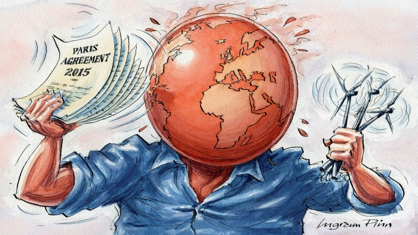

  

# Climate Change Projections Dataset
Climate change stands as one of the defining challenges of the 21st century, with its far-reaching impacts permeating every facet of human existence. From altering weather patterns to exacerbating natural disasters, the consequences of a warming planet reverberate across ecosystems, economies, and societies worldwide.

This dataset has been specifically created and used in my PhD thesis to assess the effects of such distruptive changes on the economic system by leveraging a novel machine learning algorithm developed in the same thesis and published here [^1].

[^1]: Andreani, Mila, Lea Petrella, and Nicola Salvati. "New advances in Regression Forests." Statistical Learning, Sustainability and Impact Evaluation. Pearson, 2023. 1297-1302.

In particular, the dataset amalgamates historical climate data with forward-looking projections derived from CMIP6 simulations[^2] in a longitudinal shape. Spanning the period from 1995 to 2100 and encompassing 210 countries, the dataset offers the possibility to researcher to assess the presence of climate-economic interactions. For each country-year observation, key climate variables such as temperature, precipitation, and extreme weather indices are included, alongside GDP per capita data sourced from the World Bank. Additionally, the dataset incorporates covariates representing historical values of projected climate variables, enabling researchers to explore the nuanced relationships between climate dynamics and economic outcomes.

[^2]: GDP projected data: https://tntcat.iiasa.ac.at/SspDb/dsd?Action=htmlpage&page=citation, 
GDP historical data: https://data.worldbank.org/, 
Climate-related variables historical and projected data: https://climateknowledgeportal.worldbank.org

# Dataset description and Code

The dataset contains annual longitudinal data concerning climate-related variables and GDP. The folder **_'hist'_** contains historical data from 1995 to 2014 of 210 countries, whereas the folder **_'projections'_** contains annual projected data of the climate-related variables as formulated in the Coupled Model Intercomparison Project Phase 6 (CMIP6) from 2015 to 2100 under four different scenarios: SSP1, SSP2, SSP3, SSP5.

The dataset contains also the stationarised version of the historical and projected dataframes.

Two additional files are present: the _'countries_info.xlsx'_ file contains info on the ISO-3 country codes and ids used in the dataset. The _'proj_gdp.xlsx'_ contains additional projections of GDP every 5 years up to 2100.

The code contained in the folder **_'R'_** allows to re-create the the longitudinal datasets (also the stationarized version) using R starting from raw data, contained in the .zip files 'raw_data' to be unzipped before running the code.

The following paragraphs contain additional info on the dataset.

## Variables

| Variable Name  | Description |
| ------------- | ------------- |
| **GDP**  | Gross Domestic Product per capita |
| **TMP**  | Average annual temperature  |
| **PRE**  | Average annual precipitations  |
|  **r20mm** | Precipitations >20mm  |
|  **cwd** | Maximum number of consecutive wet days  |
|  **cdd** | Maximum number of consecutive dry days  |
|  **txx** | Maximum daily temperature  |

## CMIP6 and Climate Projections

The Coupled Model Intercomparison Project Phase 6 (CMIP6) serves as a cornerstone in climate science, facilitating the comparison of climate models across various institutions and research groups worldwide. CMIP6 encompasses a vast ensemble of state-of-the-art climate models, each simulating Earth's climate system under different scenarios and assumptions.

Climate projections derived from CMIP6 simulations offer invaluable insights into potential future climate scenarios, encompassing a range of variables such as temperature, precipitation, and extreme weather events. These projections serve as crucial inputs for understanding the complex interplay between climate dynamics and socio-economic outcomes.

## Understanding the Shared Socio-economic Pathways (SSPs)

The Shared Socio-economic Pathways (SSPs) represent a set of narratives outlining plausible future socio-economic trajectories and corresponding climate scenarios. Developed by the scientific community, SSPs provide a framework for exploring how different societal choices and policy decisions could shape the future of humanity and the environment. Let's delve deeper into the key components and implications of SSPs:

### Origins and Development

The SSP framework emerged from the need for a standardized approach to integrate socio-economic factors into climate change research. Developed as part of the Fifth Assessment Report (AR5) of the Intergovernmental Panel on Climate Change (IPCC), SSPs build upon earlier scenarios such as the Special Report on Emissions Scenarios (SRES).

### Components of SSPs

SSPs are characterized by five distinct narratives, each depicting a unique vision of the future:

**SSP1: Sustainability**

SSP1 portrays a world where sustainability and environmental stewardship are paramount. It envisions rapid technological progress, low population growth, and a shift towards renewable energy sources. This pathway prioritizes sustainable development goals and emphasizes global cooperation to address climate change.

**SSP2: Middle of the Road**

SSP2 represents a future where current trends continue without significant deviation. It envisions moderate population growth, gradual technological advancements, and a mix of fossil fuels and renewable energy sources. This pathway reflects a world where socio-economic development follows historical patterns without major disruptions.

**SSP3: Regional Rivalry**

SSP3 depicts a world characterized by fragmented regional interests and limited global cooperation. It envisions high population growth, slow technological progress, and a reliance on fossil fuels. This pathway reflects a future marked by geopolitical tensions, resource competition, and uneven development.

**SSP4: Inequality**

SSP4 portrays a future defined by stark socio-economic disparities and limited environmental regulations. It envisions moderate population growth, slow technological progress, and a reliance on fossil fuels. This pathway highlights the challenges of addressing climate change in a world marked by inequality and social unrest.

**SSP5: Fossil-Fueled Development**

SSP5 represents a future where economic growth is prioritized over environmental concerns. It envisions high population growth, rapid technological progress focused on fossil fuel extraction, and limited efforts to mitigate climate change. This pathway underscores the risks of continued reliance on fossil fuels and the need for transformative change.

